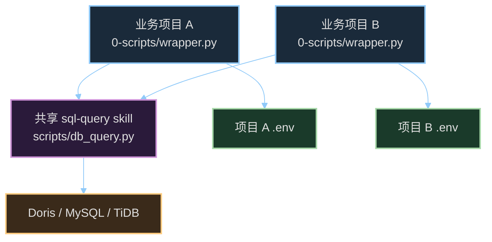
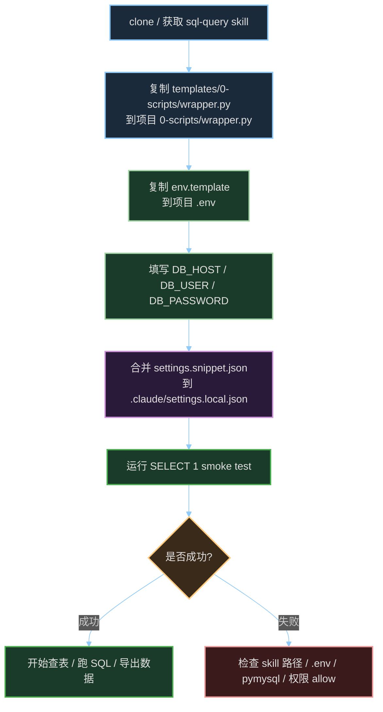

# sql-query skill

> 通过 MySQL 协议读 Doris / MySQL / TiDB 的命令行查询助手，可作为 Claude Code skill 使用。

## 这是什么

这是一个独立维护的 Claude Code skill，适合沉淀到团队公共目录或独立 Git 仓库中。

它打包了四类内容：

| 路径 | 作用 |
|------|------|
| `SKILL.md` | 给 Claude 看的触发说明和使用规则 |
| `scripts/db_query.py` | 真正执行查询的通用脚本 |
| `templates/0-scripts/wrapper.py` | 复制到业务项目 `0-scripts/` 的薄壳模板 |
| `templates/env.template` | 复制成业务项目 `.env` 的配置模板 |
| `templates/settings.snippet.json` | 合并到业务项目 `.claude/settings.local.json` 的权限片段 |

任何使用 MySQL 协议的数仓项目（Doris / MySQL / TiDB）都能复用。

## 推荐接入方式

不要把整个 `sql-query` 文件夹复制到每个业务项目里反复改。推荐做法是：

```text
一份共享 sql-query skill
+ 每个业务项目各自放一个薄壳
+ 每个业务项目各自维护 .env
+ 每个业务项目各自合并 settings allow
```

推荐目录示例：

```text
~/code/
├── claude-skills/
│   └── sql-query/
│       ├── SKILL.md
│       ├── scripts/db_query.py
│       └── templates/
│           ├── 0-scripts/wrapper.py
│           ├── env.template
│           └── settings.snippet.json
├── project-a/
│   ├── .env
│   └── 0-scripts/wrapper.py
└── project-b/
    ├── .env
    └── 0-scripts/wrapper.py
```

整体关系：



## 安装到新项目

### 1. 准备共享 skill 仓库

本机多项目共用时，只需要放一份：

```bash
git clone <repo-url> ~/code/claude-skills/sql-query
```

跨电脑给使用时，电脑上也 clone 一份到类似目录即可。

### 2. 复制薄壳模板到业务项目

进入业务项目根目录，复制 `templates/0-scripts/wrapper.py`：

```bash
mkdir -p 0-scripts
cp ~/code/claude-skills/sql-query/templates/0-scripts/wrapper.py 0-scripts/wrapper.py
```

如果当前项目已经习惯叫 `doris_query.py`，也可以复制成旧名字：

```bash
mkdir -p 0-scripts
cp ~/code/claude-skills/sql-query/templates/0-scripts/wrapper.py 0-scripts/doris_query.py
```

薄壳的作用只有一个：把当前项目的 `.env` 路径传给共享 skill 脚本，然后转发所有命令行参数。

薄壳模板核心逻辑：

```python
PROJECT_ROOT = os.path.dirname(os.path.dirname(os.path.abspath(__file__)))
PROJECT_ENV_PATH = os.path.join(PROJECT_ROOT, ".env")

SKILL_SCRIPT = os.environ.get(
    "SQL_QUERY_SKILL",
    os.path.expanduser("~/code/claude-skills/sql-query/scripts/db_query.py"),
)

env = os.environ.copy()
env.setdefault("SQL_QUERY_ENV_PATH", PROJECT_ENV_PATH)
subprocess.run([sys.executable, SKILL_SCRIPT] + sys.argv[1:], env=env)
```

如果新电脑上的 skill 路径不同，可以设置环境变量 `SQL_QUERY_SKILL`，不用改业务项目代码：

```bash
SQL_QUERY_SKILL=~/code/other-skills/sql-query/scripts/db_query.py
```

### 3. 在业务项目里创建 `.env`

把模板复制成业务项目自己的 `.env`：

```bash
cp ~/code/claude-skills/sql-query/templates/env.template .env
```

然后改成真实连接信息：

```ini
DB_TYPE=doris
DB_HOST=127.0.0.1
DB_PORT=9030
DB_USER=your_user
DB_PASSWORD=your_password
DB_DATABASE=ods
```

`.env` 里是数据库账号密码，不要提交到 Git。

### 4. 合并 Claude Code 权限片段

`templates/settings.snippet.json` 是片段，不建议直接复制覆盖项目的 `.claude/settings.local.json`。

原因是项目里可能已经有其他 allow 规则，直接覆盖会把旧规则删掉。

这里要注意：allow 规则应该写业务项目里的薄壳命令脚本，不是 skill 仓库里的 `scripts/db_query.py`。

Claude 实际执行的是：

```bash
python 0-scripts/wrapper.py --sql "SELECT ..."
```

所以 allow 要覆盖这条命令。如果你只允许：

```json
"Bash(python ~/code/claude-skills/sql-query/scripts/db_query.py*)"
```

但实际让 Claude 跑的是项目薄壳 `python 0-scripts/wrapper.py ...`，那还是可能弹 yes。

推荐做法：

1. 打开业务项目现有的 `.claude/settings.local.json`
2. 打开 `~/code/claude-skills/sql-query/templates/settings.snippet.json`
3. 只把 snippet 里的 `permissions.allow` 数组合并进去
4. 如果薄壳文件名不是 `wrapper.py`，把规则里的文件名同步改掉

常用规则：

```json
"Bash(python 0-scripts/wrapper.py*)",
"Bash(PYTHONIOENCODING=utf-8 python 0-scripts/wrapper.py*)"
```

如果薄壳叫 `doris_query.py`，就把规则里的文件名也改成：

```json
"Bash(python 0-scripts/doris_query.py*)",
"Bash(PYTHONIOENCODING=utf-8 python 0-scripts/doris_query.py*)"
```

末尾的 `*` 是通配，覆盖所有参数组合。

## 接入流程图



## 使用

```bash
# 直接执行 SQL
python 0-scripts/wrapper.py --sql "SELECT COUNT(*) FROM ods.xxx"

# 读整张表前 10 行
python 0-scripts/wrapper.py --table ods.xxx --limit 10

# 读表用裸表名 + 指定库，导出 CSV
python 0-scripts/wrapper.py --table xxx --database ods --format csv > out.csv

# 列出 DWS 库所有表
python 0-scripts/wrapper.py --list-tables --database dws

# 看表结构
python 0-scripts/wrapper.py --describe ods.xxx

# 跑 SQL 文件，导出 JSON
python 0-scripts/wrapper.py --file query.sql --format json > out.json
```

五种主参数互斥：`--sql` / `--file` / `--table` / `--list-tables` / `--describe`。

辅助参数：`--database` / `--format tab|csv|json` / `--limit N` / `--no-headers`。

## 多项目和跨电脑怎么选

| 场景 | 推荐做法 | 原因 |
|------|----------|------|
| 本机多个项目共用 | 一份共享 skill + 每个项目一个薄壳和 `.env` | 升级一次，所有项目受益 |
| 同事另一台电脑使用 | 同事 clone 一份 skill 仓库 + 项目里复制薄壳和 `.env` | 版本清楚，后续可 `git pull` |
| 临时验证 | 可以直接复制 `sql-query` 文件夹 | 快，但后续容易版本分叉 |
| 项目必须自包含 | 用 git submodule 放进 `.claude/skills/sql-query` | 能锁版本，但维护成本更高 |

结论：优先独立 skill 仓库，不优先把 skill 手工复制到每个业务项目。

## 依赖

```bash
pip install pymysql
```

未来支持 PostgreSQL 时再装 `psycopg2`。

## 为什么是 skill 而不是 pip 包

- skill 的核心价值是 Claude 能自动识别「读表 / 查数据」意图并调用，pip 包做不到
- skill 自带 `SKILL.md`、模板和权限片段，迁移到新项目更完整
- skill 是文件 + 文档 + 脚本的组合，比 pip 包更适合团队沉淀工作流

## 协议支持路线

| DB_TYPE | 驱动 | 状态 |
|---------|------|------|
| mysql | pymysql | 已支持 |
| doris | pymysql | 已支持 |
| tidb | pymysql | 已支持 |
| postgres | psycopg2 | 预留 |

加新协议只需在 `db_query.py` 的 `DRIVER_MAP` 和 `connect()` 里扩展。

## 故障排查

| 现象 | 检查 |
|------|------|
| Claude 每次问 yes | `settings.local.json` 的 allow 是否覆盖当前命令形式 |
| `FileNotFoundError: .env` | 项目根目录是否有 `.env`，薄壳是否设置 `SQL_QUERY_ENV_PATH` |
| 找不到 skill 脚本 | `SQL_QUERY_SKILL` 或薄壳里的默认路径是否正确 |
| `Access denied` | `.env` 的 `DB_USER` / `DB_PASSWORD` 是否正确 |
| `Unknown column` | 用 `--describe` 看表结构再核对字段 |
| `No module named 'pymysql'` | 执行 `pip install pymysql` |

## 许可

内部使用，未指定开源协议。
